# [📈 Live Status](https://status.hagicode.com): <!--live status--> **🟩 All systems operational**

This repository contains the open-source uptime monitor and status page for [HagiCode-org](https://status.hagicode.com), powered by [Upptime](https://github.com/upptime/upptime).

With [Upptime](https://upptime.js.org), you can get your own unlimited and free uptime monitor and status page, powered entirely by a GitHub repository. We use [Issues](https://github.com/HagiCode-org/upptime/issues) as incident reports, [Actions](https://github.com/HagiCode-org/upptime/actions) as uptime monitors, and [Pages](https://status.hagicode.com) for the status page.

<!--start: status pages-->
<!-- This summary is generated by Upptime (https://github.com/upptime/upptime) -->
<!-- Do not edit this manually, your changes will be overwritten -->
<!-- prettier-ignore -->
| URL | Status | History | Response Time | Uptime |
| --- | ------ | ------- | ------------- | ------ |
|  [HagiCode Website](https://hagicode.com) | 🟩 Up | [hagi-code-website.yml](https://github.com/HagiCode-org/upptime/commits/HEAD/history/hagi-code-website.yml) | 

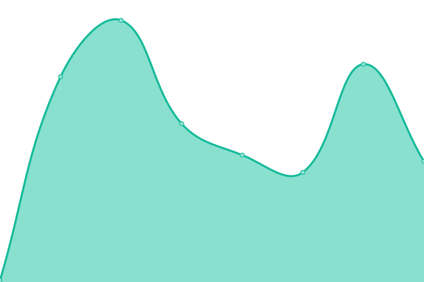 107ms
     
 | 

<a href="https://status.hagicode.com/history/hagi-code-website">100.00%</a>
    

|  [HagiCode Docs](https://docs.hagicode.com) | 🟩 Up | [hagi-code-docs.yml](https://github.com/HagiCode-org/upptime/commits/HEAD/history/hagi-code-docs.yml) | 

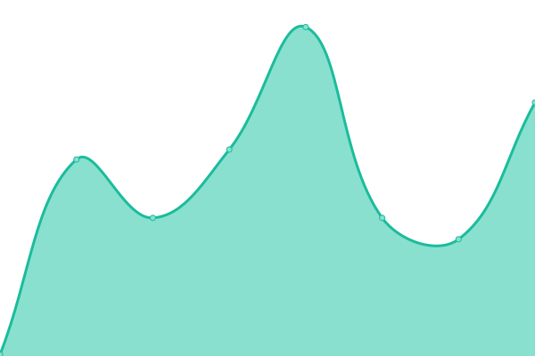 88ms
     
 | 

<a href="https://status.hagicode.com/history/hagi-code-docs">100.00%</a>
    

|  [newbe](https://newbe.hagicode.com) | 🟩 Up | [newbe.yml](https://github.com/HagiCode-org/upptime/commits/HEAD/history/newbe.yml) | 

 1454ms
     
 | 

<a href="https://status.hagicode.com/history/newbe">100.00%</a>
    

|  [Docker Compose Builder](https://builder.hagicode.com) | 🟩 Up | [docker-compose-builder.yml](https://github.com/HagiCode-org/upptime/commits/HEAD/history/docker-compose-builder.yml) | 

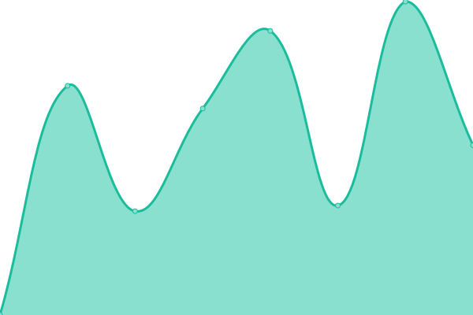 1444ms
     
 | 

<a href="https://status.hagicode.com/history/docker-compose-builder">100.00%</a>
    

|  [AI Cost Calculator](https://cost.hagicode.com) | 🟩 Up | [ai-cost-calculator.yml](https://github.com/HagiCode-org/upptime/commits/HEAD/history/ai-cost-calculator.yml) | 

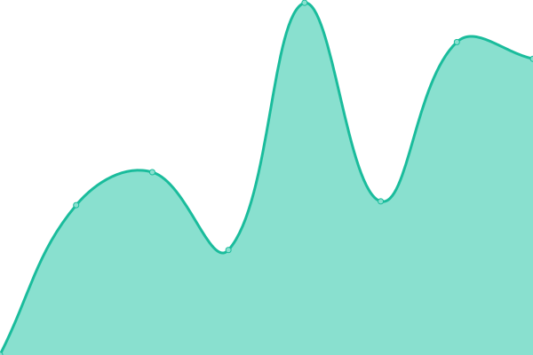 1636ms
     
 | 

<a href="https://status.hagicode.com/history/ai-cost-calculator">100.00%</a>
    

|  [HagiCode Status](https://status.hagicode.com) | 🟩 Up | [hagi-code-status.yml](https://github.com/HagiCode-org/upptime/commits/HEAD/history/hagi-code-status.yml) | 

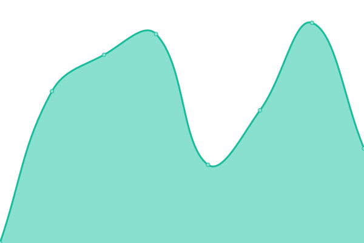 1282ms
     
 | 

<a href="https://status.hagicode.com/history/hagi-code-status">100.00%</a>
    

|  [Awesome Design MD](https://design.hagicode.com) | 🟩 Up | [awesome-design-md.yml](https://github.com/HagiCode-org/upptime/commits/HEAD/history/awesome-design-md.yml) | 

 1420ms
     
 | 

<a href="https://status.hagicode.com/history/awesome-design-md">100.00%</a>
    

|  [HagiCode Index](https://index.hagicode.com) | 🟩 Up | [hagi-code-index.yml](https://github.com/HagiCode-org/upptime/commits/HEAD/history/hagi-code-index.yml) | 

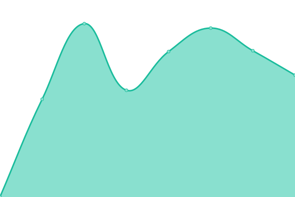 1459ms
     
 | 

<a href="https://status.hagicode.com/history/hagi-code-index">100.00%</a>
    

|  [Server Package Index](https://index.hagicode.com/server/index.json) | 🟩 Up | [server-package-index.yml](https://github.com/HagiCode-org/upptime/commits/HEAD/history/server-package-index.yml) | 

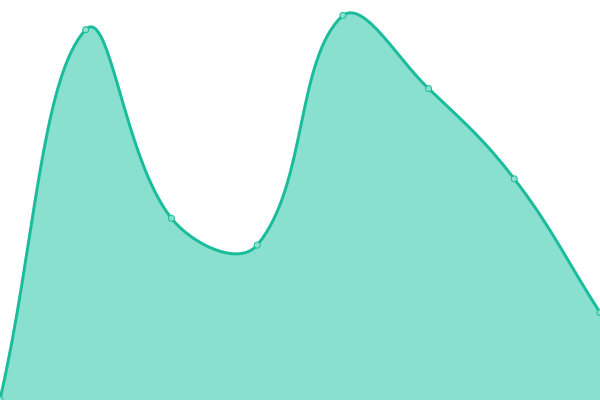 871ms
     
 | 

<a href="https://status.hagicode.com/history/server-package-index">100.00%</a>
    

|  [Desktop Package Index](https://index.hagicode.com/desktop/index.json) | 🟩 Up | [desktop-package-index.yml](https://github.com/HagiCode-org/upptime/commits/HEAD/history/desktop-package-index.yml) | 

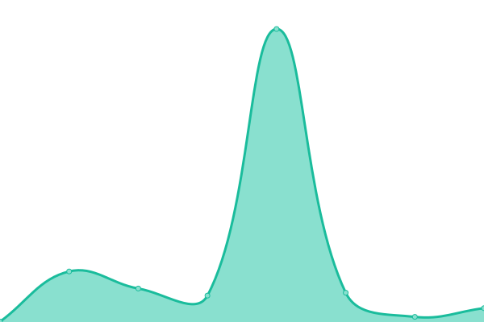 823ms
     
 | 

<a href="https://status.hagicode.com/history/desktop-package-index">100.00%</a>
    

|  [Desktop Download Index](https://desktop.dl.hagicode.com/index.json) | 🟩 Up | [desktop-download-index.yml](https://github.com/HagiCode-org/upptime/commits/HEAD/history/desktop-download-index.yml) | 

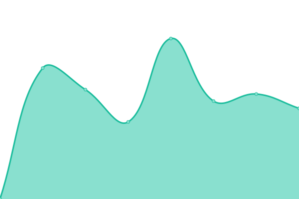 1613ms
     
 | 

<a href="https://status.hagicode.com/history/desktop-download-index">100.00%</a>
    

|  [Server Download Index](https://server.dl.hagicode.com/index.json) | 🟩 Up | [server-download-index.yml](https://github.com/HagiCode-org/upptime/commits/HEAD/history/server-download-index.yml) | 

 1320ms
     
 | 

<a href="https://status.hagicode.com/history/server-download-index">100.00%</a>
    

|  [Soul Builder](https://soul.hagicode.com) | 🟩 Up | [soul-builder.yml](https://github.com/HagiCode-org/upptime/commits/HEAD/history/soul-builder.yml) | 

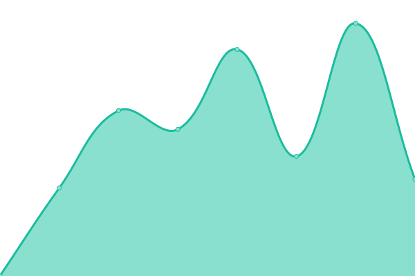 1251ms
     
 | 

<a href="https://status.hagicode.com/history/soul-builder">100.00%</a>
    

|  [Trait Builder](https://trait.hagicode.com) | 🟩 Up | [trait-builder.yml](https://github.com/HagiCode-org/upptime/commits/HEAD/history/trait-builder.yml) | 

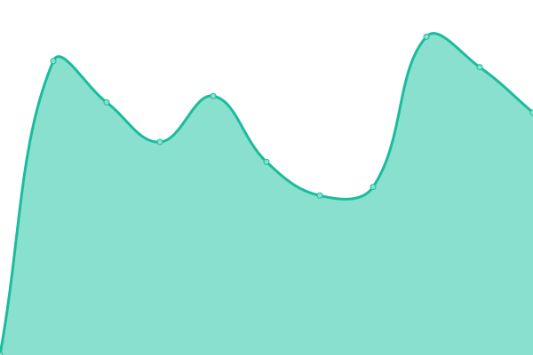 2211ms
     
 | 

<a href="https://status.hagicode.com/history/trait-builder">100.00%</a>
    

<!--end: status pages-->

[**Visit our status website →**](https://status.hagicode.com)

## 📄 License

- Powered by: [Upptime](https://github.com/upptime/upptime)
- Code: [MIT](./LICENSE) © [Anand Chowdhary](https://anandchowdhary.com), supported by [Pabio](https://pabio.com)
- Data in the `./history` directory: [Open Database License](https://opendatacommons.org/licenses/odbl/1-0/)
