# [📈 Live Status](https://status.hagicode.com): <!--live status--> **🟧 Partial outage**

This repository contains the open-source uptime monitor and status page for [HagiCode-org](https://status.hagicode.com), powered by [Upptime](https://github.com/upptime/upptime).

[](https://github.com/HagiCode-org/upptime/actions/workflows/uptime.yml)
[](https://github.com/HagiCode-org/upptime/actions/workflows/response-time.yml)
[](https://github.com/HagiCode-org/upptime/actions/workflows/graphs.yml)
[](https://github.com/HagiCode-org/upptime/actions/workflows/site.yml)
[](https://github.com/HagiCode-org/upptime/actions/workflows/summary.yml)

With [Upptime](https://upptime.js.org), you can get your own unlimited and free uptime monitor and status page, powered entirely by a GitHub repository. We use [Issues](https://github.com/HagiCode-org/upptime/issues) as incident reports, [Actions](https://github.com/HagiCode-org/upptime/actions) as uptime monitors, and [Pages](https://status.hagicode.com) for the status page.

## Public site and resource coverage

There are 15 public sites with four independent checks each (60 monitors), plus the four existing package/download JSON monitors (64 total). The 14-site initial inventory is extended by the live Hagilight Astro demo at `hagilight.hagicode.com`. The separate Starlight example at `hagistar.hagicode.com` is not included: its deployment workflow only publishes a branch, and the Hagilight deployment guide says no hosting consumer is configured. `www.hagicode.com` is the canonical alias for the existing HagiCode Website monitor; its homepage identity remains at `https://hagicode.com`. The related-sites catalog entry `https://index.hagicode.com/data/` is a subpath of HagiCode Index, not another site.

The table records the configured URL, the bounded GET result, and the expected literal body marker for each discovery resource. `marker found` and `marker missing` are literal substring results, not XML or feed validation.

| Site                   | Homepage GET                                                                    | Sitemap GET (`http://www.sitemaps.org/schemas/sitemap/0.9`)      | Robots GET (`User-agent:`)                                | Default RSS GET (`<rss`)                               |
| ---------------------- | ------------------------------------------------------------------------------- | ---------------------------------------------------------------- | --------------------------------------------------------- | ------------------------------------------------------ |
| HagiCode Website       | `https://hagicode.com` — 200; effective `https://www.hagicode.com/`             | `https://www.hagicode.com/sitemap-index.xml` — 200, found        | `https://www.hagicode.com/robots.txt` — 200, found        | `https://www.hagicode.com/rss.xml` — 200, missing      |
| HagiCode Docs          | `https://docs.hagicode.com` — 200; effective `https://docs.hagicode.com/`       | `https://docs.hagicode.com/sitemap-index.xml` — 200, found       | `https://docs.hagicode.com/robots.txt` — 200, found       | `https://docs.hagicode.com/rss.xml` — 200, found       |
| newbe                  | `https://newbe.hagicode.com` — 200; effective `https://newbe.hagicode.com/`     | `https://newbe.hagicode.com/sitemap.xml` — 200, found            | `https://newbe.hagicode.com/robots.txt` — 200, found      | `https://newbe.hagicode.com/rss.xml` — 200, missing    |
| Docker Compose Builder | `https://builder.hagicode.com` — 200; effective `https://builder.hagicode.com/` | `https://builder.hagicode.com/sitemap.xml` — 200, found          | `https://builder.hagicode.com/robots.txt` — 200, found    | `https://builder.hagicode.com/rss.xml` — 200, missing  |
| AI Cost Calculator     | `https://cost.hagicode.com` — 200; effective `https://cost.hagicode.com/`       | `https://cost.hagicode.com/sitemap.xml` — 200, found             | `https://cost.hagicode.com/robots.txt` — 200, found       | `https://cost.hagicode.com/rss.xml` — 200, missing     |
| HagiCode Status        | `https://status.hagicode.com` — 200; effective `https://status.hagicode.com/`   | `https://status.hagicode.com/sitemap.xml` — 404, missing         | `https://status.hagicode.com/robots.txt` — 404, missing   | `https://status.hagicode.com/rss.xml` — 404, missing   |
| Awesome Design MD      | `https://design.hagicode.com` — 200; effective `https://design.hagicode.com/`   | `https://design.hagicode.com/sitemap-index.xml` — 200, found     | `https://design.hagicode.com/robots.txt` — 200, found     | `https://design.hagicode.com/rss.xml` — 200, missing   |
| HagiCode Index         | `https://index.hagicode.com` — 200; effective `https://index.hagicode.com/`     | `https://index.hagicode.com/sitemap-index.xml` — 200, found      | `https://index.hagicode.com/robots.txt` — 200, found      | `https://index.hagicode.com/rss.xml` — 200, missing    |
| Soul Builder           | `https://soul.hagicode.com` — 200; effective `https://soul.hagicode.com/`       | `https://soul.hagicode.com/sitemap.xml` — 200, found             | `https://soul.hagicode.com/robots.txt` — 200, found       | `https://soul.hagicode.com/rss.xml` — 200, missing     |
| Trait Builder          | `https://trait.hagicode.com` — 200; effective `https://trait.hagicode.com/`     | `https://trait.hagicode.com/sitemap-index.xml` — 200, found      | `https://trait.hagicode.com/robots.txt` — 200, found      | `https://trait.hagicode.com/rss.xml` — 200, missing    |
| HagiTask               | `https://tasks.hagicode.com` — 200; effective `https://tasks.hagicode.com/`     | `https://tasks.hagicode.com/sitemap-index.xml` — 200, found      | `https://tasks.hagicode.com/robots.txt` — 200, found      | `https://tasks.hagicode.com/rss.xml` — 200, missing    |
| OpenSpec Docs          | `https://openspec.hagicode.com/` — 200                                          | `https://openspec.hagicode.com/sitemap-index.xml` — 200, found   | `https://openspec.hagicode.com/robots.txt` — 200, found   | `https://openspec.hagicode.com/rss.xml` — 200, found   |
| OmniRoute Docs         | `https://omniroute.hagicode.com/` — 200                                         | `https://omniroute.hagicode.com/sitemap-index.xml` — 200, found  | `https://omniroute.hagicode.com/robots.txt` — 200, found  | `https://omniroute.hagicode.com/rss.xml` — 200, found  |
| Impeccable             | `https://impeccable.hagicode.com/` — 200                                        | `https://impeccable.hagicode.com/sitemap-index.xml` — 200, found | `https://impeccable.hagicode.com/robots.txt` — 200, found | `https://impeccable.hagicode.com/rss.xml` — 200, found |
| Hagilight Demo         | `https://hagilight.hagicode.com/` — 200                                         | `https://hagilight.hagicode.com/sitemap-index.xml` — 200, found  | `https://hagilight.hagicode.com/robots.txt` — 200, found  | `https://hagilight.hagicode.com/rss.xml` — 200, found  |

The four unchanged JSON monitors also returned HTTP 200 at their configured URLs: Server Package Index (`https://index.hagicode.com/server/index.json`), Desktop Package Index (`https://index.hagicode.com/desktop/index.json`), Desktop Download Index (`https://desktop.dl.hagicode.com/index.json`), and Server Download Index (`https://server.dl.hagicode.com/index.json`). For all resource and JSON requests, the effective URL equaled the configured URL. Original homepage URLs without a trailing slash resolved to the same origin with `/`; the HagiCode Website homepage is the sole cross-host redirect.

### Canonical paths and expectations

Sitemap URLs use the published `Sitemap:` directive in `robots.txt` where available, backed by site deployment configuration: the canonical HagiCode, Docs, Design, Index, Trait, HagiTask, OpenSpec, OmniRoute, Impeccable, and Hagilight demo URLs use `/sitemap-index.xml`; newbe uses the Docusaurus-configured `/sitemap.xml`; Builder and Cost use their documented `/sitemap.xml`; Soul uses the path published by its robots file, `/sitemap.xml`. The status page does not publish discovery paths, so its root `/sitemap.xml`, `/robots.txt`, and `/rss.xml` entries are explicit intended-path assumptions and currently fail.

Every robots URL is at the origin root. The default feed is `/rss.xml` for each site; the Docs, OpenSpec Docs, OmniRoute Docs, Impeccable, and Hagilight demo feeds are published there. Where no published feed link or deployment route establishes a feed, `/rss.xml` remains the intended default rather than being omitted. In particular, the HagiTask footer points to `/rss.xml`, but the observed response is HTML rather than a feed. The current root deployments use no additional base path; URLs with an observed or configured base path must retain it if that deployment contract changes.

All sitemap monitors require the literal sitemap namespace, which accepts either sitemap-index or URL-set documents. Robots checks require `User-agent:`; RSS checks require `<rss`. These are case-sensitive native substring predicates, not regular expressions. The new homepage checks and every discovery-resource check accept only HTTP 200. Existing homepage status behavior is unchanged.

### Probe snapshot and known failing baselines

Snapshot from 2026-09-30. All 64 bounded GETs completed with an HTTP response; no endpoint was marked unavailable because of the probe environment. Of the 45 discovery resources, 33 returned HTTP 200 with their marker. Twelve remain configured as failures:

- `https://www.hagicode.com/rss.xml`, `https://newbe.hagicode.com/rss.xml`, `https://builder.hagicode.com/rss.xml`, `https://cost.hagicode.com/rss.xml`, `https://design.hagicode.com/rss.xml`, `https://index.hagicode.com/rss.xml`, `https://soul.hagicode.com/rss.xml`, `https://trait.hagicode.com/rss.xml`, and `https://tasks.hagicode.com/rss.xml` returned HTTP 200 with `text/html` and no `<rss` marker.
- `https://status.hagicode.com/sitemap.xml`, `https://status.hagicode.com/robots.txt`, and `https://status.hagicode.com/rss.xml` returned HTTP 404.

These are observed endpoint baselines, not successful probes. Do not change the expected status, remove a marker, or remove a monitor to make the status page green. A failure opens or updates the normal GitHub Issues incident for that site/resource; repeated failures do not create another issue. On recovery, Upptime comments on and closes the existing incident. The scheduled uptime workflow remains at five-minute intervals; issue notification uses the repository's existing GitHub/notification configuration, with no new credentials or channel.

The pinned `upptime/uptime-monitor@v1.42.6` evaluator compares `expectedStatusCodes` and the literal body predicate together. Its HTTP client follows up to three redirects by default, then evaluates the final response; a redirect loop, unsuccessful final status, TLS error, or timeout remains a failure. TLS verification stays enabled. A local fixture exercise against the pinned evaluator covered sitemap index and URL-set, robots, RSS and Atom markers, empty and HTML bodies, 404/500/201 responses, successful and failing redirects, redirect-limit exhaustion, and timeout. A local mocked lifecycle confirmed one resource-attributed issue on failure, no duplicate on repeated failure, and closure on recovery.

### Reproducible checks

Run this from `repos/upptime/` in the monorepo to parse the configuration and check its inventory and identities:

```sh
node <<'NODE'
const assert = require("node:assert/strict");
const fs = require("node:fs");
const yaml = require("js-yaml");
const sites = yaml.load(fs.readFileSync(".upptimerc.yml", "utf8")).sites;
const resources = sites.filter((site) => / (Sitemap|Robots|RSS)$/.test(site.name));
const homes = sites.filter((site) => !site.url.endsWith(".json") && !/ (Sitemap|Robots|RSS)$/.test(site.name));
const json = sites.filter((site) => site.url.endsWith(".json"));
const slugs = sites.map((site) => site.slug || site.name.toLowerCase().replace(/[^a-z0-9]+/g, "-").replace(/^-|-$/g, ""));
assert.equal(homes.length, 15);
assert.equal(resources.length, 45);
assert.equal(json.length, 4);
assert.equal(sites.length, 64);
assert.equal(new Set(sites.map((site) => site.name)).size, sites.length);
assert.equal(new Set(slugs).size, sites.length);
for (const home of homes) {
  for (const resource of ["Sitemap", "Robots", "RSS"]) {
    const monitor = sites.find((site) => site.name === `${home.name} ${resource}`);
    assert.ok(monitor, `${home.name} is missing ${resource}`);
    assert.equal(monitor.expectedStatusCodes.join(","), "200");
    assert.ok(monitor.slug);
    assert.ok(monitor.__dangerous__body_down_if_text_missing);
  }
}
console.log("64 monitors, 15 sites, 45 discovery resources, four JSON monitors; identities and coverage are unique.");
NODE
```

Probe any listed URL with a bounded read-only GET. Set `marker` to the resource's expected literal above; omit the marker check for homepages and JSON endpoints. Repeat for every configured URL to refresh the snapshot:

```sh
url='https://docs.hagicode.com/sitemap-index.xml'
marker='http://www.sitemaps.org/schemas/sitemap/0.9'
body=$(mktemp)
if ! curl --silent --show-error --location --max-redirs 3 \
  --connect-timeout 4 --max-time 12 --max-filesize 10485760 \
  --output "$body" --write-out 'HTTP %{http_code}; effective %{url_effective}\n' "$url"; then
  rm -f "$body"
  echo 'Probe unavailable; this is not evidence of an endpoint failure.' >&2
  exit 1
fi
if grep -Fq -- "$marker" "$body"; then echo 'marker: present'; else echo 'marker: missing'; fi
rm -f "$body"
```

The command does not use `--fail`, so HTTP error responses are recorded rather than hidden. A nonzero curl exit (for example, DNS/TLS/connection failure or the time/size bound) means the endpoint was not observed; it must not be documented as an HTTP failure.

<!--start: status pages-->
<!-- This summary is generated by Upptime (https://github.com/upptime/upptime) -->
<!-- Do not edit this manually, your changes will be overwritten -->
<!-- prettier-ignore -->
| URL | Status | History | Response Time | Uptime |
| --- | ------ | ------- | ------------- | ------ |
|  [HagiCode Website](https://hagicode.com) | 🟩 Up | [hagi-code-website.yml](https://github.com/HagiCode-org/upptime/commits/HEAD/history/hagi-code-website.yml) | <details><summary>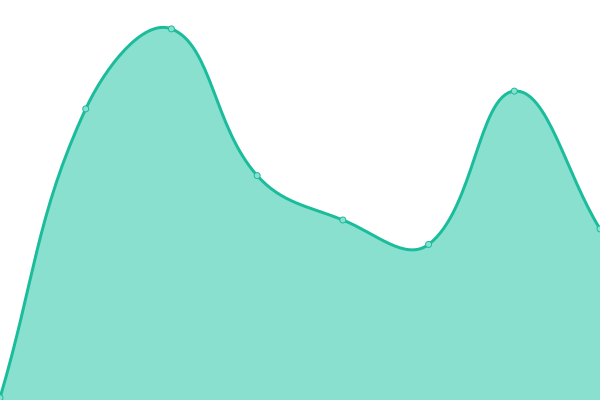 1203ms</summary><br><a href="https://status.hagicode.com/history/hagi-code-website"></a><br><a href="https://status.hagicode.com/history/hagi-code-website"></a><br><a href="https://status.hagicode.com/history/hagi-code-website"></a><br><a href="https://status.hagicode.com/history/hagi-code-website"></a><br><a href="https://status.hagicode.com/history/hagi-code-website"></a></details> | <details><summary><a href="https://status.hagicode.com/history/hagi-code-website">100.00%</a></summary><a href="https://status.hagicode.com/history/hagi-code-website"></a><br><a href="https://status.hagicode.com/history/hagi-code-website"></a><br><a href="https://status.hagicode.com/history/hagi-code-website"></a><br><a href="https://status.hagicode.com/history/hagi-code-website"></a><br><a href="https://status.hagicode.com/history/hagi-code-website"></a></details>
|  [HagiCode Website Sitemap](https://www.hagicode.com/sitemap-index.xml) | 🟩 Up | [hagi-code-website-sitemap.yml](https://github.com/HagiCode-org/upptime/commits/HEAD/history/hagi-code-website-sitemap.yml) | <details><summary> 725ms</summary><br><a href="https://status.hagicode.com/history/hagi-code-website-sitemap"></a><br><a href="https://status.hagicode.com/history/hagi-code-website-sitemap"></a><br><a href="https://status.hagicode.com/history/hagi-code-website-sitemap"></a><br><a href="https://status.hagicode.com/history/hagi-code-website-sitemap"></a><br><a href="https://status.hagicode.com/history/hagi-code-website-sitemap"></a></details> | <details><summary><a href="https://status.hagicode.com/history/hagi-code-website-sitemap">100.00%</a></summary><a href="https://status.hagicode.com/history/hagi-code-website-sitemap"></a><br><a href="https://status.hagicode.com/history/hagi-code-website-sitemap"></a><br><a href="https://status.hagicode.com/history/hagi-code-website-sitemap"></a><br><a href="https://status.hagicode.com/history/hagi-code-website-sitemap"></a><br><a href="https://status.hagicode.com/history/hagi-code-website-sitemap"></a></details>
|  [HagiCode Website Robots](https://www.hagicode.com/robots.txt) | 🟩 Up | [hagi-code-website-robots.yml](https://github.com/HagiCode-org/upptime/commits/HEAD/history/hagi-code-website-robots.yml) | <details><summary> 165ms</summary><br><a href="https://status.hagicode.com/history/hagi-code-website-robots"></a><br><a href="https://status.hagicode.com/history/hagi-code-website-robots"></a><br><a href="https://status.hagicode.com/history/hagi-code-website-robots"></a><br><a href="https://status.hagicode.com/history/hagi-code-website-robots"></a><br><a href="https://status.hagicode.com/history/hagi-code-website-robots"></a></details> | <details><summary><a href="https://status.hagicode.com/history/hagi-code-website-robots">100.00%</a></summary><a href="https://status.hagicode.com/history/hagi-code-website-robots"></a><br><a href="https://status.hagicode.com/history/hagi-code-website-robots"></a><br><a href="https://status.hagicode.com/history/hagi-code-website-robots"></a><br><a href="https://status.hagicode.com/history/hagi-code-website-robots"></a><br><a href="https://status.hagicode.com/history/hagi-code-website-robots"></a></details>
|  [HagiCode Website RSS](https://www.hagicode.com/rss.xml) | 🟩 Up | [hagi-code-website-rss.yml](https://github.com/HagiCode-org/upptime/commits/HEAD/history/hagi-code-website-rss.yml) | <details><summary> 491ms</summary><br><a href="https://status.hagicode.com/history/hagi-code-website-rss"></a><br><a href="https://status.hagicode.com/history/hagi-code-website-rss"></a><br><a href="https://status.hagicode.com/history/hagi-code-website-rss"></a><br><a href="https://status.hagicode.com/history/hagi-code-website-rss"></a><br><a href="https://status.hagicode.com/history/hagi-code-website-rss"></a></details> | <details><summary><a href="https://status.hagicode.com/history/hagi-code-website-rss">73.70%</a></summary><a href="https://status.hagicode.com/history/hagi-code-website-rss"></a><br><a href="https://status.hagicode.com/history/hagi-code-website-rss"></a><br><a href="https://status.hagicode.com/history/hagi-code-website-rss"></a><br><a href="https://status.hagicode.com/history/hagi-code-website-rss"></a><br><a href="https://status.hagicode.com/history/hagi-code-website-rss"></a></details>
|  [HagiCode Docs](https://docs.hagicode.com) | 🟩 Up | [hagi-code-docs.yml](https://github.com/HagiCode-org/upptime/commits/HEAD/history/hagi-code-docs.yml) | <details><summary>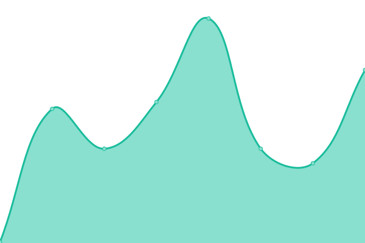 116ms</summary><br><a href="https://status.hagicode.com/history/hagi-code-docs"></a><br><a href="https://status.hagicode.com/history/hagi-code-docs"></a><br><a href="https://status.hagicode.com/history/hagi-code-docs"></a><br><a href="https://status.hagicode.com/history/hagi-code-docs"></a><br><a href="https://status.hagicode.com/history/hagi-code-docs"></a></details> | <details><summary><a href="https://status.hagicode.com/history/hagi-code-docs">100.00%</a></summary><a href="https://status.hagicode.com/history/hagi-code-docs"></a><br><a href="https://status.hagicode.com/history/hagi-code-docs"></a><br><a href="https://status.hagicode.com/history/hagi-code-docs"></a><br><a href="https://status.hagicode.com/history/hagi-code-docs"></a><br><a href="https://status.hagicode.com/history/hagi-code-docs"></a></details>
|  [HagiCode Docs Sitemap](https://docs.hagicode.com/sitemap-index.xml) | 🟩 Up | [hagi-code-docs-sitemap.yml](https://github.com/HagiCode-org/upptime/commits/HEAD/history/hagi-code-docs-sitemap.yml) | <details><summary> 83ms</summary><br><a href="https://status.hagicode.com/history/hagi-code-docs-sitemap"></a><br><a href="https://status.hagicode.com/history/hagi-code-docs-sitemap"></a><br><a href="https://status.hagicode.com/history/hagi-code-docs-sitemap"></a><br><a href="https://status.hagicode.com/history/hagi-code-docs-sitemap"></a><br><a href="https://status.hagicode.com/history/hagi-code-docs-sitemap"></a></details> | <details><summary><a href="https://status.hagicode.com/history/hagi-code-docs-sitemap">100.00%</a></summary><a href="https://status.hagicode.com/history/hagi-code-docs-sitemap"></a><br><a href="https://status.hagicode.com/history/hagi-code-docs-sitemap"></a><br><a href="https://status.hagicode.com/history/hagi-code-docs-sitemap"></a><br><a href="https://status.hagicode.com/history/hagi-code-docs-sitemap"></a><br><a href="https://status.hagicode.com/history/hagi-code-docs-sitemap"></a></details>
|  [HagiCode Docs Robots](https://docs.hagicode.com/robots.txt) | 🟩 Up | [hagi-code-docs-robots.yml](https://github.com/HagiCode-org/upptime/commits/HEAD/history/hagi-code-docs-robots.yml) | <details><summary> 54ms</summary><br><a href="https://status.hagicode.com/history/hagi-code-docs-robots"></a><br><a href="https://status.hagicode.com/history/hagi-code-docs-robots"></a><br><a href="https://status.hagicode.com/history/hagi-code-docs-robots"></a><br><a href="https://status.hagicode.com/history/hagi-code-docs-robots"></a><br><a href="https://status.hagicode.com/history/hagi-code-docs-robots"></a></details> | <details><summary><a href="https://status.hagicode.com/history/hagi-code-docs-robots">100.00%</a></summary><a href="https://status.hagicode.com/history/hagi-code-docs-robots"></a><br><a href="https://status.hagicode.com/history/hagi-code-docs-robots"></a><br><a href="https://status.hagicode.com/history/hagi-code-docs-robots"></a><br><a href="https://status.hagicode.com/history/hagi-code-docs-robots"></a><br><a href="https://status.hagicode.com/history/hagi-code-docs-robots"></a></details>
|  [HagiCode Docs RSS](https://docs.hagicode.com/rss.xml) | 🟩 Up | [hagi-code-docs-rss.yml](https://github.com/HagiCode-org/upptime/commits/HEAD/history/hagi-code-docs-rss.yml) | <details><summary> 87ms</summary><br><a href="https://status.hagicode.com/history/hagi-code-docs-rss"></a><br><a href="https://status.hagicode.com/history/hagi-code-docs-rss"></a><br><a href="https://status.hagicode.com/history/hagi-code-docs-rss"></a><br><a href="https://status.hagicode.com/history/hagi-code-docs-rss"></a><br><a href="https://status.hagicode.com/history/hagi-code-docs-rss"></a></details> | <details><summary><a href="https://status.hagicode.com/history/hagi-code-docs-rss">100.00%</a></summary><a href="https://status.hagicode.com/history/hagi-code-docs-rss"></a><br><a href="https://status.hagicode.com/history/hagi-code-docs-rss"></a><br><a href="https://status.hagicode.com/history/hagi-code-docs-rss"></a><br><a href="https://status.hagicode.com/history/hagi-code-docs-rss"></a><br><a href="https://status.hagicode.com/history/hagi-code-docs-rss"></a></details>
|  [newbe](https://newbe.hagicode.com) | 🟩 Up | [newbe.yml](https://github.com/HagiCode-org/upptime/commits/HEAD/history/newbe.yml) | <details><summary> 741ms</summary><br><a href="https://status.hagicode.com/history/newbe"></a><br><a href="https://status.hagicode.com/history/newbe"></a><br><a href="https://status.hagicode.com/history/newbe"></a><br><a href="https://status.hagicode.com/history/newbe"></a><br><a href="https://status.hagicode.com/history/newbe"></a></details> | <details><summary><a href="https://status.hagicode.com/history/newbe">100.00%</a></summary><a href="https://status.hagicode.com/history/newbe"></a><br><a href="https://status.hagicode.com/history/newbe"></a><br><a href="https://status.hagicode.com/history/newbe"></a><br><a href="https://status.hagicode.com/history/newbe"></a><br><a href="https://status.hagicode.com/history/newbe"></a></details>
|  [newbe Sitemap](https://newbe.hagicode.com/sitemap.xml) | 🟩 Up | [newbe-sitemap.yml](https://github.com/HagiCode-org/upptime/commits/HEAD/history/newbe-sitemap.yml) | <details><summary> 551ms</summary><br><a href="https://status.hagicode.com/history/newbe-sitemap"></a><br><a href="https://status.hagicode.com/history/newbe-sitemap"></a><br><a href="https://status.hagicode.com/history/newbe-sitemap"></a><br><a href="https://status.hagicode.com/history/newbe-sitemap"></a><br><a href="https://status.hagicode.com/history/newbe-sitemap"></a></details> | <details><summary><a href="https://status.hagicode.com/history/newbe-sitemap">100.00%</a></summary><a href="https://status.hagicode.com/history/newbe-sitemap"></a><br><a href="https://status.hagicode.com/history/newbe-sitemap"></a><br><a href="https://status.hagicode.com/history/newbe-sitemap"></a><br><a href="https://status.hagicode.com/history/newbe-sitemap"></a><br><a href="https://status.hagicode.com/history/newbe-sitemap"></a></details>
|  [newbe Robots](https://newbe.hagicode.com/robots.txt) | 🟩 Up | [newbe-robots.yml](https://github.com/HagiCode-org/upptime/commits/HEAD/history/newbe-robots.yml) | <details><summary> 453ms</summary><br><a href="https://status.hagicode.com/history/newbe-robots"></a><br><a href="https://status.hagicode.com/history/newbe-robots"></a><br><a href="https://status.hagicode.com/history/newbe-robots"></a><br><a href="https://status.hagicode.com/history/newbe-robots"></a><br><a href="https://status.hagicode.com/history/newbe-robots"></a></details> | <details><summary><a href="https://status.hagicode.com/history/newbe-robots">100.00%</a></summary><a href="https://status.hagicode.com/history/newbe-robots"></a><br><a href="https://status.hagicode.com/history/newbe-robots"></a><br><a href="https://status.hagicode.com/history/newbe-robots"></a><br><a href="https://status.hagicode.com/history/newbe-robots"></a><br><a href="https://status.hagicode.com/history/newbe-robots"></a></details>
|  [newbe RSS](https://newbe.hagicode.com/rss.xml) | 🟥 Down | [newbe-rss.yml](https://github.com/HagiCode-org/upptime/commits/HEAD/history/newbe-rss.yml) | <details><summary> 206ms</summary><br><a href="https://status.hagicode.com/history/newbe-rss"></a><br><a href="https://status.hagicode.com/history/newbe-rss"></a><br><a href="https://status.hagicode.com/history/newbe-rss"></a><br><a href="https://status.hagicode.com/history/newbe-rss"></a><br><a href="https://status.hagicode.com/history/newbe-rss"></a></details> | <details><summary><a href="https://status.hagicode.com/history/newbe-rss">0.00%</a></summary><a href="https://status.hagicode.com/history/newbe-rss"></a><br><a href="https://status.hagicode.com/history/newbe-rss"></a><br><a href="https://status.hagicode.com/history/newbe-rss"></a><br><a href="https://status.hagicode.com/history/newbe-rss"></a><br><a href="https://status.hagicode.com/history/newbe-rss"></a></details>
|  [Docker Compose Builder](https://builder.hagicode.com) | 🟩 Up | [docker-compose-builder.yml](https://github.com/HagiCode-org/upptime/commits/HEAD/history/docker-compose-builder.yml) | <details><summary>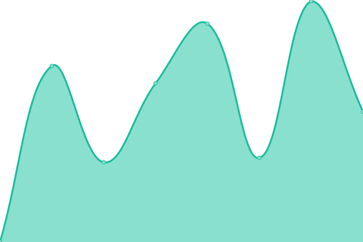 805ms</summary><br><a href="https://status.hagicode.com/history/docker-compose-builder"></a><br><a href="https://status.hagicode.com/history/docker-compose-builder"></a><br><a href="https://status.hagicode.com/history/docker-compose-builder"></a><br><a href="https://status.hagicode.com/history/docker-compose-builder"></a><br><a href="https://status.hagicode.com/history/docker-compose-builder"></a></details> | <details><summary><a href="https://status.hagicode.com/history/docker-compose-builder">100.00%</a></summary><a href="https://status.hagicode.com/history/docker-compose-builder"></a><br><a href="https://status.hagicode.com/history/docker-compose-builder"></a><br><a href="https://status.hagicode.com/history/docker-compose-builder"></a><br><a href="https://status.hagicode.com/history/docker-compose-builder"></a><br><a href="https://status.hagicode.com/history/docker-compose-builder"></a></details>
|  [Docker Compose Builder Sitemap](https://builder.hagicode.com/sitemap.xml) | 🟩 Up | [docker-compose-builder-sitemap.yml](https://github.com/HagiCode-org/upptime/commits/HEAD/history/docker-compose-builder-sitemap.yml) | <details><summary> 788ms</summary><br><a href="https://status.hagicode.com/history/docker-compose-builder-sitemap"></a><br><a href="https://status.hagicode.com/history/docker-compose-builder-sitemap"></a><br><a href="https://status.hagicode.com/history/docker-compose-builder-sitemap"></a><br><a href="https://status.hagicode.com/history/docker-compose-builder-sitemap"></a><br><a href="https://status.hagicode.com/history/docker-compose-builder-sitemap"></a></details> | <details><summary><a href="https://status.hagicode.com/history/docker-compose-builder-sitemap">100.00%</a></summary><a href="https://status.hagicode.com/history/docker-compose-builder-sitemap"></a><br><a href="https://status.hagicode.com/history/docker-compose-builder-sitemap"></a><br><a href="https://status.hagicode.com/history/docker-compose-builder-sitemap"></a><br><a href="https://status.hagicode.com/history/docker-compose-builder-sitemap"></a><br><a href="https://status.hagicode.com/history/docker-compose-builder-sitemap"></a></details>
|  [Docker Compose Builder Robots](https://builder.hagicode.com/robots.txt) | 🟩 Up | [docker-compose-builder-robots.yml](https://github.com/HagiCode-org/upptime/commits/HEAD/history/docker-compose-builder-robots.yml) | <details><summary> 418ms</summary><br><a href="https://status.hagicode.com/history/docker-compose-builder-robots"></a><br><a href="https://status.hagicode.com/history/docker-compose-builder-robots"></a><br><a href="https://status.hagicode.com/history/docker-compose-builder-robots"></a><br><a href="https://status.hagicode.com/history/docker-compose-builder-robots"></a><br><a href="https://status.hagicode.com/history/docker-compose-builder-robots"></a></details> | <details><summary><a href="https://status.hagicode.com/history/docker-compose-builder-robots">100.00%</a></summary><a href="https://status.hagicode.com/history/docker-compose-builder-robots"></a><br><a href="https://status.hagicode.com/history/docker-compose-builder-robots"></a><br><a href="https://status.hagicode.com/history/docker-compose-builder-robots"></a><br><a href="https://status.hagicode.com/history/docker-compose-builder-robots"></a><br><a href="https://status.hagicode.com/history/docker-compose-builder-robots"></a></details>
|  [Docker Compose Builder RSS](https://builder.hagicode.com/rss.xml) | 🟥 Down | [docker-compose-builder-rss.yml](https://github.com/HagiCode-org/upptime/commits/HEAD/history/docker-compose-builder-rss.yml) | <details><summary> 262ms</summary><br><a href="https://status.hagicode.com/history/docker-compose-builder-rss"></a><br><a href="https://status.hagicode.com/history/docker-compose-builder-rss"></a><br><a href="https://status.hagicode.com/history/docker-compose-builder-rss"></a><br><a href="https://status.hagicode.com/history/docker-compose-builder-rss"></a><br><a href="https://status.hagicode.com/history/docker-compose-builder-rss"></a></details> | <details><summary><a href="https://status.hagicode.com/history/docker-compose-builder-rss">0.00%</a></summary><a href="https://status.hagicode.com/history/docker-compose-builder-rss"></a><br><a href="https://status.hagicode.com/history/docker-compose-builder-rss"></a><br><a href="https://status.hagicode.com/history/docker-compose-builder-rss"></a><br><a href="https://status.hagicode.com/history/docker-compose-builder-rss"></a><br><a href="https://status.hagicode.com/history/docker-compose-builder-rss"></a></details>
|  [AI Cost Calculator](https://cost.hagicode.com) | 🟩 Up | [ai-cost-calculator.yml](https://github.com/HagiCode-org/upptime/commits/HEAD/history/ai-cost-calculator.yml) | <details><summary>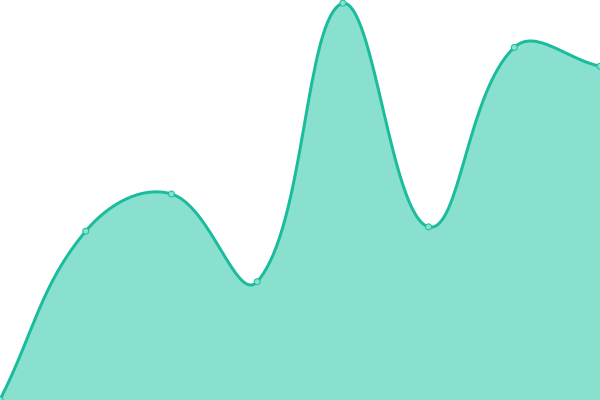 1076ms</summary><br><a href="https://status.hagicode.com/history/ai-cost-calculator"></a><br><a href="https://status.hagicode.com/history/ai-cost-calculator"></a><br><a href="https://status.hagicode.com/history/ai-cost-calculator"></a><br><a href="https://status.hagicode.com/history/ai-cost-calculator"></a><br><a href="https://status.hagicode.com/history/ai-cost-calculator"></a></details> | <details><summary><a href="https://status.hagicode.com/history/ai-cost-calculator">100.00%</a></summary><a href="https://status.hagicode.com/history/ai-cost-calculator"></a><br><a href="https://status.hagicode.com/history/ai-cost-calculator"></a><br><a href="https://status.hagicode.com/history/ai-cost-calculator"></a><br><a href="https://status.hagicode.com/history/ai-cost-calculator"></a><br><a href="https://status.hagicode.com/history/ai-cost-calculator"></a></details>
|  [AI Cost Calculator Sitemap](https://cost.hagicode.com/sitemap.xml) | 🟩 Up | [ai-cost-calculator-sitemap.yml](https://github.com/HagiCode-org/upptime/commits/HEAD/history/ai-cost-calculator-sitemap.yml) | <details><summary> 251ms</summary><br><a href="https://status.hagicode.com/history/ai-cost-calculator-sitemap"></a><br><a href="https://status.hagicode.com/history/ai-cost-calculator-sitemap"></a><br><a href="https://status.hagicode.com/history/ai-cost-calculator-sitemap"></a><br><a href="https://status.hagicode.com/history/ai-cost-calculator-sitemap"></a><br><a href="https://status.hagicode.com/history/ai-cost-calculator-sitemap"></a></details> | <details><summary><a href="https://status.hagicode.com/history/ai-cost-calculator-sitemap">100.00%</a></summary><a href="https://status.hagicode.com/history/ai-cost-calculator-sitemap"></a><br><a href="https://status.hagicode.com/history/ai-cost-calculator-sitemap"></a><br><a href="https://status.hagicode.com/history/ai-cost-calculator-sitemap"></a><br><a href="https://status.hagicode.com/history/ai-cost-calculator-sitemap"></a><br><a href="https://status.hagicode.com/history/ai-cost-calculator-sitemap"></a></details>
|  [AI Cost Calculator Robots](https://cost.hagicode.com/robots.txt) | 🟩 Up | [ai-cost-calculator-robots.yml](https://github.com/HagiCode-org/upptime/commits/HEAD/history/ai-cost-calculator-robots.yml) | <details><summary> 791ms</summary><br><a href="https://status.hagicode.com/history/ai-cost-calculator-robots"></a><br><a href="https://status.hagicode.com/history/ai-cost-calculator-robots"></a><br><a href="https://status.hagicode.com/history/ai-cost-calculator-robots"></a><br><a href="https://status.hagicode.com/history/ai-cost-calculator-robots"></a><br><a href="https://status.hagicode.com/history/ai-cost-calculator-robots"></a></details> | <details><summary><a href="https://status.hagicode.com/history/ai-cost-calculator-robots">100.00%</a></summary><a href="https://status.hagicode.com/history/ai-cost-calculator-robots"></a><br><a href="https://status.hagicode.com/history/ai-cost-calculator-robots"></a><br><a href="https://status.hagicode.com/history/ai-cost-calculator-robots"></a><br><a href="https://status.hagicode.com/history/ai-cost-calculator-robots"></a><br><a href="https://status.hagicode.com/history/ai-cost-calculator-robots"></a></details>
|  [AI Cost Calculator RSS](https://cost.hagicode.com/rss.xml) | 🟥 Down | [ai-cost-calculator-rss.yml](https://github.com/HagiCode-org/upptime/commits/HEAD/history/ai-cost-calculator-rss.yml) | <details><summary> 133ms</summary><br><a href="https://status.hagicode.com/history/ai-cost-calculator-rss"></a><br><a href="https://status.hagicode.com/history/ai-cost-calculator-rss"></a><br><a href="https://status.hagicode.com/history/ai-cost-calculator-rss"></a><br><a href="https://status.hagicode.com/history/ai-cost-calculator-rss"></a><br><a href="https://status.hagicode.com/history/ai-cost-calculator-rss"></a></details> | <details><summary><a href="https://status.hagicode.com/history/ai-cost-calculator-rss">0.00%</a></summary><a href="https://status.hagicode.com/history/ai-cost-calculator-rss"></a><br><a href="https://status.hagicode.com/history/ai-cost-calculator-rss"></a><br><a href="https://status.hagicode.com/history/ai-cost-calculator-rss"></a><br><a href="https://status.hagicode.com/history/ai-cost-calculator-rss"></a><br><a href="https://status.hagicode.com/history/ai-cost-calculator-rss"></a></details>
|  [HagiCode Status](https://status.hagicode.com) | 🟩 Up | [hagi-code-status.yml](https://github.com/HagiCode-org/upptime/commits/HEAD/history/hagi-code-status.yml) | <details><summary>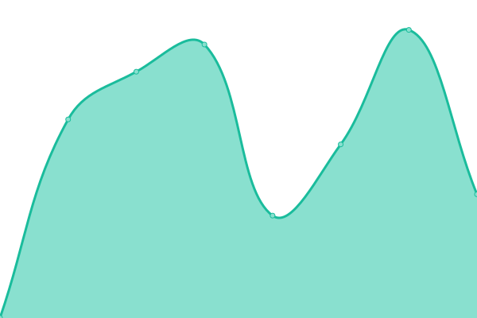 811ms</summary><br><a href="https://status.hagicode.com/history/hagi-code-status"></a><br><a href="https://status.hagicode.com/history/hagi-code-status"></a><br><a href="https://status.hagicode.com/history/hagi-code-status"></a><br><a href="https://status.hagicode.com/history/hagi-code-status"></a><br><a href="https://status.hagicode.com/history/hagi-code-status"></a></details> | <details><summary><a href="https://status.hagicode.com/history/hagi-code-status">100.00%</a></summary><a href="https://status.hagicode.com/history/hagi-code-status"></a><br><a href="https://status.hagicode.com/history/hagi-code-status"></a><br><a href="https://status.hagicode.com/history/hagi-code-status"></a><br><a href="https://status.hagicode.com/history/hagi-code-status"></a><br><a href="https://status.hagicode.com/history/hagi-code-status"></a></details>
|  [HagiCode Status Sitemap](https://status.hagicode.com/sitemap.xml) | 🟥 Down | [hagi-code-status-sitemap.yml](https://github.com/HagiCode-org/upptime/commits/HEAD/history/hagi-code-status-sitemap.yml) | <details><summary> 154ms</summary><br><a href="https://status.hagicode.com/history/hagi-code-status-sitemap"></a><br><a href="https://status.hagicode.com/history/hagi-code-status-sitemap"></a><br><a href="https://status.hagicode.com/history/hagi-code-status-sitemap"></a><br><a href="https://status.hagicode.com/history/hagi-code-status-sitemap"></a><br><a href="https://status.hagicode.com/history/hagi-code-status-sitemap"></a></details> | <details><summary><a href="https://status.hagicode.com/history/hagi-code-status-sitemap">0.00%</a></summary><a href="https://status.hagicode.com/history/hagi-code-status-sitemap"></a><br><a href="https://status.hagicode.com/history/hagi-code-status-sitemap"></a><br><a href="https://status.hagicode.com/history/hagi-code-status-sitemap"></a><br><a href="https://status.hagicode.com/history/hagi-code-status-sitemap"></a><br><a href="https://status.hagicode.com/history/hagi-code-status-sitemap"></a></details>
|  [HagiCode Status Robots](https://status.hagicode.com/robots.txt) | 🟥 Down | [hagi-code-status-robots.yml](https://github.com/HagiCode-org/upptime/commits/HEAD/history/hagi-code-status-robots.yml) | <details><summary> 121ms</summary><br><a href="https://status.hagicode.com/history/hagi-code-status-robots"></a><br><a href="https://status.hagicode.com/history/hagi-code-status-robots"></a><br><a href="https://status.hagicode.com/history/hagi-code-status-robots"></a><br><a href="https://status.hagicode.com/history/hagi-code-status-robots"></a><br><a href="https://status.hagicode.com/history/hagi-code-status-robots"></a></details> | <details><summary><a href="https://status.hagicode.com/history/hagi-code-status-robots">0.00%</a></summary><a href="https://status.hagicode.com/history/hagi-code-status-robots"></a><br><a href="https://status.hagicode.com/history/hagi-code-status-robots"></a><br><a href="https://status.hagicode.com/history/hagi-code-status-robots"></a><br><a href="https://status.hagicode.com/history/hagi-code-status-robots"></a><br><a href="https://status.hagicode.com/history/hagi-code-status-robots"></a></details>
|  [HagiCode Status RSS](https://status.hagicode.com/rss.xml) | 🟥 Down | [hagi-code-status-rss.yml](https://github.com/HagiCode-org/upptime/commits/HEAD/history/hagi-code-status-rss.yml) | <details><summary> 167ms</summary><br><a href="https://status.hagicode.com/history/hagi-code-status-rss"></a><br><a href="https://status.hagicode.com/history/hagi-code-status-rss"></a><br><a href="https://status.hagicode.com/history/hagi-code-status-rss"></a><br><a href="https://status.hagicode.com/history/hagi-code-status-rss"></a><br><a href="https://status.hagicode.com/history/hagi-code-status-rss"></a></details> | <details><summary><a href="https://status.hagicode.com/history/hagi-code-status-rss">0.00%</a></summary><a href="https://status.hagicode.com/history/hagi-code-status-rss"></a><br><a href="https://status.hagicode.com/history/hagi-code-status-rss"></a><br><a href="https://status.hagicode.com/history/hagi-code-status-rss"></a><br><a href="https://status.hagicode.com/history/hagi-code-status-rss"></a><br><a href="https://status.hagicode.com/history/hagi-code-status-rss"></a></details>
|  [Awesome Design MD](https://design.hagicode.com) | 🟩 Up | [awesome-design-md.yml](https://github.com/HagiCode-org/upptime/commits/HEAD/history/awesome-design-md.yml) | <details><summary> 1612ms</summary><br><a href="https://status.hagicode.com/history/awesome-design-md"></a><br><a href="https://status.hagicode.com/history/awesome-design-md"></a><br><a href="https://status.hagicode.com/history/awesome-design-md"></a><br><a href="https://status.hagicode.com/history/awesome-design-md"></a><br><a href="https://status.hagicode.com/history/awesome-design-md"></a></details> | <details><summary><a href="https://status.hagicode.com/history/awesome-design-md">100.00%</a></summary><a href="https://status.hagicode.com/history/awesome-design-md"></a><br><a href="https://status.hagicode.com/history/awesome-design-md"></a><br><a href="https://status.hagicode.com/history/awesome-design-md"></a><br><a href="https://status.hagicode.com/history/awesome-design-md"></a><br><a href="https://status.hagicode.com/history/awesome-design-md"></a></details>
|  [Awesome Design MD Sitemap](https://design.hagicode.com/sitemap-index.xml) | 🟩 Up | [awesome-design-md-sitemap.yml](https://github.com/HagiCode-org/upptime/commits/HEAD/history/awesome-design-md-sitemap.yml) | <details><summary> 441ms</summary><br><a href="https://status.hagicode.com/history/awesome-design-md-sitemap"></a><br><a href="https://status.hagicode.com/history/awesome-design-md-sitemap"></a><br><a href="https://status.hagicode.com/history/awesome-design-md-sitemap"></a><br><a href="https://status.hagicode.com/history/awesome-design-md-sitemap"></a><br><a href="https://status.hagicode.com/history/awesome-design-md-sitemap"></a></details> | <details><summary><a href="https://status.hagicode.com/history/awesome-design-md-sitemap">100.00%</a></summary><a href="https://status.hagicode.com/history/awesome-design-md-sitemap"></a><br><a href="https://status.hagicode.com/history/awesome-design-md-sitemap"></a><br><a href="https://status.hagicode.com/history/awesome-design-md-sitemap"></a><br><a href="https://status.hagicode.com/history/awesome-design-md-sitemap"></a><br><a href="https://status.hagicode.com/history/awesome-design-md-sitemap"></a></details>
|  [Awesome Design MD Robots](https://design.hagicode.com/robots.txt) | 🟩 Up | [awesome-design-md-robots.yml](https://github.com/HagiCode-org/upptime/commits/HEAD/history/awesome-design-md-robots.yml) | <details><summary> 369ms</summary><br><a href="https://status.hagicode.com/history/awesome-design-md-robots"></a><br><a href="https://status.hagicode.com/history/awesome-design-md-robots"></a><br><a href="https://status.hagicode.com/history/awesome-design-md-robots"></a><br><a href="https://status.hagicode.com/history/awesome-design-md-robots"></a><br><a href="https://status.hagicode.com/history/awesome-design-md-robots"></a></details> | <details><summary><a href="https://status.hagicode.com/history/awesome-design-md-robots">100.00%</a></summary><a href="https://status.hagicode.com/history/awesome-design-md-robots"></a><br><a href="https://status.hagicode.com/history/awesome-design-md-robots"></a><br><a href="https://status.hagicode.com/history/awesome-design-md-robots"></a><br><a href="https://status.hagicode.com/history/awesome-design-md-robots"></a><br><a href="https://status.hagicode.com/history/awesome-design-md-robots"></a></details>
|  [Awesome Design MD RSS](https://design.hagicode.com/rss.xml) | 🟩 Up | [awesome-design-md-rss.yml](https://github.com/HagiCode-org/upptime/commits/HEAD/history/awesome-design-md-rss.yml) | <details><summary> 644ms</summary><br><a href="https://status.hagicode.com/history/awesome-design-md-rss"></a><br><a href="https://status.hagicode.com/history/awesome-design-md-rss"></a><br><a href="https://status.hagicode.com/history/awesome-design-md-rss"></a><br><a href="https://status.hagicode.com/history/awesome-design-md-rss"></a><br><a href="https://status.hagicode.com/history/awesome-design-md-rss"></a></details> | <details><summary><a href="https://status.hagicode.com/history/awesome-design-md-rss">73.70%</a></summary><a href="https://status.hagicode.com/history/awesome-design-md-rss"></a><br><a href="https://status.hagicode.com/history/awesome-design-md-rss"></a><br><a href="https://status.hagicode.com/history/awesome-design-md-rss"></a><br><a href="https://status.hagicode.com/history/awesome-design-md-rss"></a><br><a href="https://status.hagicode.com/history/awesome-design-md-rss"></a></details>
|  [HagiCode Index](https://index.hagicode.com) | 🟩 Up | [hagi-code-index.yml](https://github.com/HagiCode-org/upptime/commits/HEAD/history/hagi-code-index.yml) | <details><summary>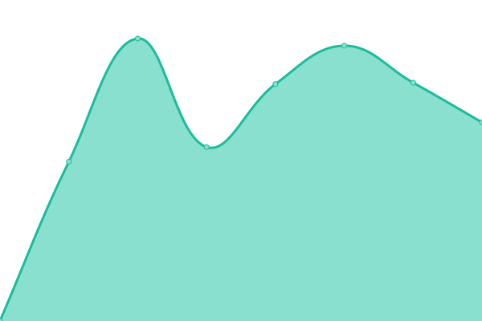 636ms</summary><br><a href="https://status.hagicode.com/history/hagi-code-index"></a><br><a href="https://status.hagicode.com/history/hagi-code-index"></a><br><a href="https://status.hagicode.com/history/hagi-code-index"></a><br><a href="https://status.hagicode.com/history/hagi-code-index"></a><br><a href="https://status.hagicode.com/history/hagi-code-index"></a></details> | <details><summary><a href="https://status.hagicode.com/history/hagi-code-index">100.00%</a></summary><a href="https://status.hagicode.com/history/hagi-code-index"></a><br><a href="https://status.hagicode.com/history/hagi-code-index"></a><br><a href="https://status.hagicode.com/history/hagi-code-index"></a><br><a href="https://status.hagicode.com/history/hagi-code-index"></a><br><a href="https://status.hagicode.com/history/hagi-code-index"></a></details>
|  [Server Package Index](https://index.hagicode.com/server/index.json) | 🟩 Up | [server-package-index.yml](https://github.com/HagiCode-org/upptime/commits/HEAD/history/server-package-index.yml) | <details><summary>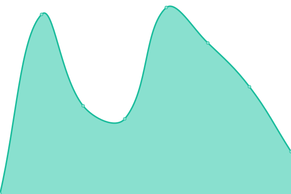 565ms</summary><br><a href="https://status.hagicode.com/history/server-package-index"></a><br><a href="https://status.hagicode.com/history/server-package-index"></a><br><a href="https://status.hagicode.com/history/server-package-index"></a><br><a href="https://status.hagicode.com/history/server-package-index"></a><br><a href="https://status.hagicode.com/history/server-package-index"></a></details> | <details><summary><a href="https://status.hagicode.com/history/server-package-index">100.00%</a></summary><a href="https://status.hagicode.com/history/server-package-index"></a><br><a href="https://status.hagicode.com/history/server-package-index"></a><br><a href="https://status.hagicode.com/history/server-package-index"></a><br><a href="https://status.hagicode.com/history/server-package-index"></a><br><a href="https://status.hagicode.com/history/server-package-index"></a></details>
|  [Desktop Package Index](https://index.hagicode.com/desktop/index.json) | 🟩 Up | [desktop-package-index.yml](https://github.com/HagiCode-org/upptime/commits/HEAD/history/desktop-package-index.yml) | <details><summary>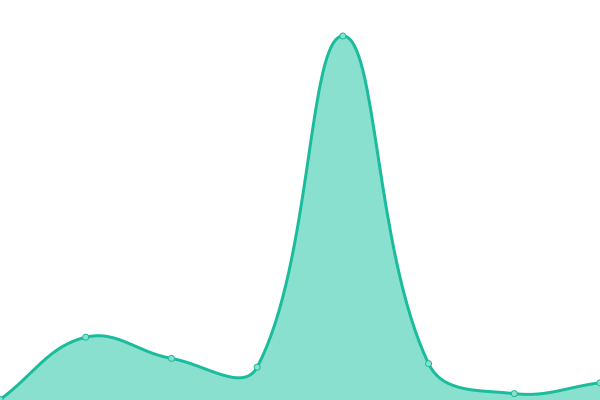 870ms</summary><br><a href="https://status.hagicode.com/history/desktop-package-index"></a><br><a href="https://status.hagicode.com/history/desktop-package-index"></a><br><a href="https://status.hagicode.com/history/desktop-package-index"></a><br><a href="https://status.hagicode.com/history/desktop-package-index"></a><br><a href="https://status.hagicode.com/history/desktop-package-index"></a></details> | <details><summary><a href="https://status.hagicode.com/history/desktop-package-index">100.00%</a></summary><a href="https://status.hagicode.com/history/desktop-package-index"></a><br><a href="https://status.hagicode.com/history/desktop-package-index"></a><br><a href="https://status.hagicode.com/history/desktop-package-index"></a><br><a href="https://status.hagicode.com/history/desktop-package-index"></a><br><a href="https://status.hagicode.com/history/desktop-package-index"></a></details>
|  [Desktop Download Index](https://desktop.dl.hagicode.com/index.json) | 🟩 Up | [desktop-download-index.yml](https://github.com/HagiCode-org/upptime/commits/HEAD/history/desktop-download-index.yml) | <details><summary>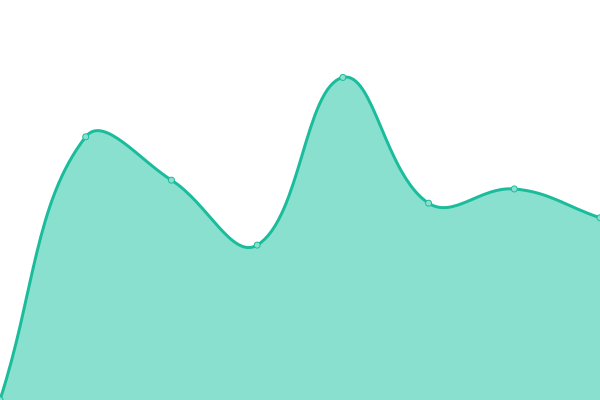 1417ms</summary><br><a href="https://status.hagicode.com/history/desktop-download-index"></a><br><a href="https://status.hagicode.com/history/desktop-download-index"></a><br><a href="https://status.hagicode.com/history/desktop-download-index"></a><br><a href="https://status.hagicode.com/history/desktop-download-index"></a><br><a href="https://status.hagicode.com/history/desktop-download-index"></a></details> | <details><summary><a href="https://status.hagicode.com/history/desktop-download-index">100.00%</a></summary><a href="https://status.hagicode.com/history/desktop-download-index"></a><br><a href="https://status.hagicode.com/history/desktop-download-index"></a><br><a href="https://status.hagicode.com/history/desktop-download-index"></a><br><a href="https://status.hagicode.com/history/desktop-download-index"></a><br><a href="https://status.hagicode.com/history/desktop-download-index"></a></details>
|  [Server Download Index](https://server.dl.hagicode.com/index.json) | 🟩 Up | [server-download-index.yml](https://github.com/HagiCode-org/upptime/commits/HEAD/history/server-download-index.yml) | <details><summary> 1533ms</summary><br><a href="https://status.hagicode.com/history/server-download-index"></a><br><a href="https://status.hagicode.com/history/server-download-index"></a><br><a href="https://status.hagicode.com/history/server-download-index"></a><br><a href="https://status.hagicode.com/history/server-download-index"></a><br><a href="https://status.hagicode.com/history/server-download-index"></a></details> | <details><summary><a href="https://status.hagicode.com/history/server-download-index">100.00%</a></summary><a href="https://status.hagicode.com/history/server-download-index"></a><br><a href="https://status.hagicode.com/history/server-download-index"></a><br><a href="https://status.hagicode.com/history/server-download-index"></a><br><a href="https://status.hagicode.com/history/server-download-index"></a><br><a href="https://status.hagicode.com/history/server-download-index"></a></details>
|  [HagiCode Index Sitemap](https://index.hagicode.com/sitemap-index.xml) | 🟩 Up | [hagi-code-index-sitemap.yml](https://github.com/HagiCode-org/upptime/commits/HEAD/history/hagi-code-index-sitemap.yml) | <details><summary> 516ms</summary><br><a href="https://status.hagicode.com/history/hagi-code-index-sitemap"></a><br><a href="https://status.hagicode.com/history/hagi-code-index-sitemap"></a><br><a href="https://status.hagicode.com/history/hagi-code-index-sitemap"></a><br><a href="https://status.hagicode.com/history/hagi-code-index-sitemap"></a><br><a href="https://status.hagicode.com/history/hagi-code-index-sitemap"></a></details> | <details><summary><a href="https://status.hagicode.com/history/hagi-code-index-sitemap">100.00%</a></summary><a href="https://status.hagicode.com/history/hagi-code-index-sitemap"></a><br><a href="https://status.hagicode.com/history/hagi-code-index-sitemap"></a><br><a href="https://status.hagicode.com/history/hagi-code-index-sitemap"></a><br><a href="https://status.hagicode.com/history/hagi-code-index-sitemap"></a><br><a href="https://status.hagicode.com/history/hagi-code-index-sitemap"></a></details>
|  [HagiCode Index Robots](https://index.hagicode.com/robots.txt) | 🟩 Up | [hagi-code-index-robots.yml](https://github.com/HagiCode-org/upptime/commits/HEAD/history/hagi-code-index-robots.yml) | <details><summary> 359ms</summary><br><a href="https://status.hagicode.com/history/hagi-code-index-robots"></a><br><a href="https://status.hagicode.com/history/hagi-code-index-robots"></a><br><a href="https://status.hagicode.com/history/hagi-code-index-robots"></a><br><a href="https://status.hagicode.com/history/hagi-code-index-robots"></a><br><a href="https://status.hagicode.com/history/hagi-code-index-robots"></a></details> | <details><summary><a href="https://status.hagicode.com/history/hagi-code-index-robots">100.00%</a></summary><a href="https://status.hagicode.com/history/hagi-code-index-robots"></a><br><a href="https://status.hagicode.com/history/hagi-code-index-robots"></a><br><a href="https://status.hagicode.com/history/hagi-code-index-robots"></a><br><a href="https://status.hagicode.com/history/hagi-code-index-robots"></a><br><a href="https://status.hagicode.com/history/hagi-code-index-robots"></a></details>
|  [HagiCode Index RSS](https://index.hagicode.com/rss.xml) | 🟩 Up | [hagi-code-index-rss.yml](https://github.com/HagiCode-org/upptime/commits/HEAD/history/hagi-code-index-rss.yml) | <details><summary> 642ms</summary><br><a href="https://status.hagicode.com/history/hagi-code-index-rss"></a><br><a href="https://status.hagicode.com/history/hagi-code-index-rss"></a><br><a href="https://status.hagicode.com/history/hagi-code-index-rss"></a><br><a href="https://status.hagicode.com/history/hagi-code-index-rss"></a><br><a href="https://status.hagicode.com/history/hagi-code-index-rss"></a></details> | <details><summary><a href="https://status.hagicode.com/history/hagi-code-index-rss">73.70%</a></summary><a href="https://status.hagicode.com/history/hagi-code-index-rss"></a><br><a href="https://status.hagicode.com/history/hagi-code-index-rss"></a><br><a href="https://status.hagicode.com/history/hagi-code-index-rss"></a><br><a href="https://status.hagicode.com/history/hagi-code-index-rss"></a><br><a href="https://status.hagicode.com/history/hagi-code-index-rss"></a></details>
|  [Soul Builder](https://soul.hagicode.com) | 🟩 Up | [soul-builder.yml](https://github.com/HagiCode-org/upptime/commits/HEAD/history/soul-builder.yml) | <details><summary>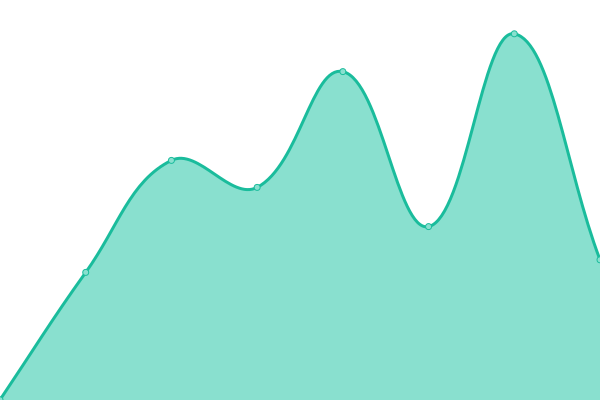 860ms</summary><br><a href="https://status.hagicode.com/history/soul-builder"></a><br><a href="https://status.hagicode.com/history/soul-builder"></a><br><a href="https://status.hagicode.com/history/soul-builder"></a><br><a href="https://status.hagicode.com/history/soul-builder"></a><br><a href="https://status.hagicode.com/history/soul-builder"></a></details> | <details><summary><a href="https://status.hagicode.com/history/soul-builder">100.00%</a></summary><a href="https://status.hagicode.com/history/soul-builder"></a><br><a href="https://status.hagicode.com/history/soul-builder"></a><br><a href="https://status.hagicode.com/history/soul-builder"></a><br><a href="https://status.hagicode.com/history/soul-builder"></a><br><a href="https://status.hagicode.com/history/soul-builder"></a></details>
|  [Soul Builder Sitemap](https://soul.hagicode.com/sitemap.xml) | 🟩 Up | [soul-builder-sitemap.yml](https://github.com/HagiCode-org/upptime/commits/HEAD/history/soul-builder-sitemap.yml) | <details><summary> 294ms</summary><br><a href="https://status.hagicode.com/history/soul-builder-sitemap"></a><br><a href="https://status.hagicode.com/history/soul-builder-sitemap"></a><br><a href="https://status.hagicode.com/history/soul-builder-sitemap"></a><br><a href="https://status.hagicode.com/history/soul-builder-sitemap"></a><br><a href="https://status.hagicode.com/history/soul-builder-sitemap"></a></details> | <details><summary><a href="https://status.hagicode.com/history/soul-builder-sitemap">100.00%</a></summary><a href="https://status.hagicode.com/history/soul-builder-sitemap"></a><br><a href="https://status.hagicode.com/history/soul-builder-sitemap"></a><br><a href="https://status.hagicode.com/history/soul-builder-sitemap"></a><br><a href="https://status.hagicode.com/history/soul-builder-sitemap"></a><br><a href="https://status.hagicode.com/history/soul-builder-sitemap"></a></details>
|  [Soul Builder Robots](https://soul.hagicode.com/robots.txt) | 🟩 Up | [soul-builder-robots.yml](https://github.com/HagiCode-org/upptime/commits/HEAD/history/soul-builder-robots.yml) | <details><summary> 600ms</summary><br><a href="https://status.hagicode.com/history/soul-builder-robots"></a><br><a href="https://status.hagicode.com/history/soul-builder-robots"></a><br><a href="https://status.hagicode.com/history/soul-builder-robots"></a><br><a href="https://status.hagicode.com/history/soul-builder-robots"></a><br><a href="https://status.hagicode.com/history/soul-builder-robots"></a></details> | <details><summary><a href="https://status.hagicode.com/history/soul-builder-robots">100.00%</a></summary><a href="https://status.hagicode.com/history/soul-builder-robots"></a><br><a href="https://status.hagicode.com/history/soul-builder-robots"></a><br><a href="https://status.hagicode.com/history/soul-builder-robots"></a><br><a href="https://status.hagicode.com/history/soul-builder-robots"></a><br><a href="https://status.hagicode.com/history/soul-builder-robots"></a></details>
|  [Soul Builder RSS](https://soul.hagicode.com/rss.xml) | 🟥 Down | [soul-builder-rss.yml](https://github.com/HagiCode-org/upptime/commits/HEAD/history/soul-builder-rss.yml) | <details><summary> 439ms</summary><br><a href="https://status.hagicode.com/history/soul-builder-rss"></a><br><a href="https://status.hagicode.com/history/soul-builder-rss"></a><br><a href="https://status.hagicode.com/history/soul-builder-rss"></a><br><a href="https://status.hagicode.com/history/soul-builder-rss"></a><br><a href="https://status.hagicode.com/history/soul-builder-rss"></a></details> | <details><summary><a href="https://status.hagicode.com/history/soul-builder-rss">0.00%</a></summary><a href="https://status.hagicode.com/history/soul-builder-rss"></a><br><a href="https://status.hagicode.com/history/soul-builder-rss"></a><br><a href="https://status.hagicode.com/history/soul-builder-rss"></a><br><a href="https://status.hagicode.com/history/soul-builder-rss"></a><br><a href="https://status.hagicode.com/history/soul-builder-rss"></a></details>
|  [Trait Builder](https://trait.hagicode.com) | 🟩 Up | [trait-builder.yml](https://github.com/HagiCode-org/upptime/commits/HEAD/history/trait-builder.yml) | <details><summary>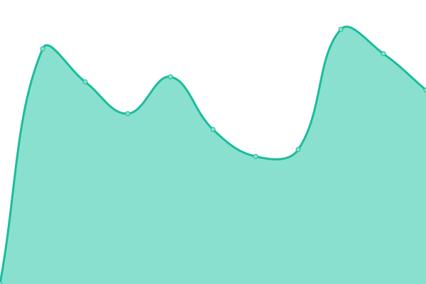 1354ms</summary><br><a href="https://status.hagicode.com/history/trait-builder"></a><br><a href="https://status.hagicode.com/history/trait-builder"></a><br><a href="https://status.hagicode.com/history/trait-builder"></a><br><a href="https://status.hagicode.com/history/trait-builder"></a><br><a href="https://status.hagicode.com/history/trait-builder"></a></details> | <details><summary><a href="https://status.hagicode.com/history/trait-builder">100.00%</a></summary><a href="https://status.hagicode.com/history/trait-builder"></a><br><a href="https://status.hagicode.com/history/trait-builder"></a><br><a href="https://status.hagicode.com/history/trait-builder"></a><br><a href="https://status.hagicode.com/history/trait-builder"></a><br><a href="https://status.hagicode.com/history/trait-builder"></a></details>
|  [Trait Builder Sitemap](https://trait.hagicode.com/sitemap-index.xml) | 🟩 Up | [trait-builder-sitemap.yml](https://github.com/HagiCode-org/upptime/commits/HEAD/history/trait-builder-sitemap.yml) | <details><summary> 362ms</summary><br><a href="https://status.hagicode.com/history/trait-builder-sitemap"></a><br><a href="https://status.hagicode.com/history/trait-builder-sitemap"></a><br><a href="https://status.hagicode.com/history/trait-builder-sitemap"></a><br><a href="https://status.hagicode.com/history/trait-builder-sitemap"></a><br><a href="https://status.hagicode.com/history/trait-builder-sitemap"></a></details> | <details><summary><a href="https://status.hagicode.com/history/trait-builder-sitemap">100.00%</a></summary><a href="https://status.hagicode.com/history/trait-builder-sitemap"></a><br><a href="https://status.hagicode.com/history/trait-builder-sitemap"></a><br><a href="https://status.hagicode.com/history/trait-builder-sitemap"></a><br><a href="https://status.hagicode.com/history/trait-builder-sitemap"></a><br><a href="https://status.hagicode.com/history/trait-builder-sitemap"></a></details>
|  [Trait Builder Robots](https://trait.hagicode.com/robots.txt) | 🟩 Up | [trait-builder-robots.yml](https://github.com/HagiCode-org/upptime/commits/HEAD/history/trait-builder-robots.yml) | <details><summary> 502ms</summary><br><a href="https://status.hagicode.com/history/trait-builder-robots"></a><br><a href="https://status.hagicode.com/history/trait-builder-robots"></a><br><a href="https://status.hagicode.com/history/trait-builder-robots"></a><br><a href="https://status.hagicode.com/history/trait-builder-robots"></a><br><a href="https://status.hagicode.com/history/trait-builder-robots"></a></details> | <details><summary><a href="https://status.hagicode.com/history/trait-builder-robots">100.00%</a></summary><a href="https://status.hagicode.com/history/trait-builder-robots"></a><br><a href="https://status.hagicode.com/history/trait-builder-robots"></a><br><a href="https://status.hagicode.com/history/trait-builder-robots"></a><br><a href="https://status.hagicode.com/history/trait-builder-robots"></a><br><a href="https://status.hagicode.com/history/trait-builder-robots"></a></details>
|  [Trait Builder RSS](https://trait.hagicode.com/rss.xml) | 🟩 Up | [trait-builder-rss.yml](https://github.com/HagiCode-org/upptime/commits/HEAD/history/trait-builder-rss.yml) | <details><summary> 868ms</summary><br><a href="https://status.hagicode.com/history/trait-builder-rss"></a><br><a href="https://status.hagicode.com/history/trait-builder-rss"></a><br><a href="https://status.hagicode.com/history/trait-builder-rss"></a><br><a href="https://status.hagicode.com/history/trait-builder-rss"></a><br><a href="https://status.hagicode.com/history/trait-builder-rss"></a></details> | <details><summary><a href="https://status.hagicode.com/history/trait-builder-rss">73.70%</a></summary><a href="https://status.hagicode.com/history/trait-builder-rss"></a><br><a href="https://status.hagicode.com/history/trait-builder-rss"></a><br><a href="https://status.hagicode.com/history/trait-builder-rss"></a><br><a href="https://status.hagicode.com/history/trait-builder-rss"></a><br><a href="https://status.hagicode.com/history/trait-builder-rss"></a></details>
|  [HagiTask](https://tasks.hagicode.com) | 🟩 Up | [hagi-task.yml](https://github.com/HagiCode-org/upptime/commits/HEAD/history/hagi-task.yml) | <details><summary> 629ms</summary><br><a href="https://status.hagicode.com/history/hagi-task"></a><br><a href="https://status.hagicode.com/history/hagi-task"></a><br><a href="https://status.hagicode.com/history/hagi-task"></a><br><a href="https://status.hagicode.com/history/hagi-task"></a><br><a href="https://status.hagicode.com/history/hagi-task"></a></details> | <details><summary><a href="https://status.hagicode.com/history/hagi-task">100.00%</a></summary><a href="https://status.hagicode.com/history/hagi-task"></a><br><a href="https://status.hagicode.com/history/hagi-task"></a><br><a href="https://status.hagicode.com/history/hagi-task"></a><br><a href="https://status.hagicode.com/history/hagi-task"></a><br><a href="https://status.hagicode.com/history/hagi-task"></a></details>
|  [HagiTask Sitemap](https://tasks.hagicode.com/sitemap-index.xml) | 🟩 Up | [hagitask-sitemap.yml](https://github.com/HagiCode-org/upptime/commits/HEAD/history/hagitask-sitemap.yml) | <details><summary> 817ms</summary><br><a href="https://status.hagicode.com/history/hagitask-sitemap"></a><br><a href="https://status.hagicode.com/history/hagitask-sitemap"></a><br><a href="https://status.hagicode.com/history/hagitask-sitemap"></a><br><a href="https://status.hagicode.com/history/hagitask-sitemap"></a><br><a href="https://status.hagicode.com/history/hagitask-sitemap"></a></details> | <details><summary><a href="https://status.hagicode.com/history/hagitask-sitemap">100.00%</a></summary><a href="https://status.hagicode.com/history/hagitask-sitemap"></a><br><a href="https://status.hagicode.com/history/hagitask-sitemap"></a><br><a href="https://status.hagicode.com/history/hagitask-sitemap"></a><br><a href="https://status.hagicode.com/history/hagitask-sitemap"></a><br><a href="https://status.hagicode.com/history/hagitask-sitemap"></a></details>
|  [HagiTask Robots](https://tasks.hagicode.com/robots.txt) | 🟩 Up | [hagitask-robots.yml](https://github.com/HagiCode-org/upptime/commits/HEAD/history/hagitask-robots.yml) | <details><summary> 425ms</summary><br><a href="https://status.hagicode.com/history/hagitask-robots"></a><br><a href="https://status.hagicode.com/history/hagitask-robots"></a><br><a href="https://status.hagicode.com/history/hagitask-robots"></a><br><a href="https://status.hagicode.com/history/hagitask-robots"></a><br><a href="https://status.hagicode.com/history/hagitask-robots"></a></details> | <details><summary><a href="https://status.hagicode.com/history/hagitask-robots">100.00%</a></summary><a href="https://status.hagicode.com/history/hagitask-robots"></a><br><a href="https://status.hagicode.com/history/hagitask-robots"></a><br><a href="https://status.hagicode.com/history/hagitask-robots"></a><br><a href="https://status.hagicode.com/history/hagitask-robots"></a><br><a href="https://status.hagicode.com/history/hagitask-robots"></a></details>
|  [HagiTask RSS](https://tasks.hagicode.com/rss.xml) | 🟩 Up | [hagitask-rss.yml](https://github.com/HagiCode-org/upptime/commits/HEAD/history/hagitask-rss.yml) | <details><summary> 629ms</summary><br><a href="https://status.hagicode.com/history/hagitask-rss"></a><br><a href="https://status.hagicode.com/history/hagitask-rss"></a><br><a href="https://status.hagicode.com/history/hagitask-rss"></a><br><a href="https://status.hagicode.com/history/hagitask-rss"></a><br><a href="https://status.hagicode.com/history/hagitask-rss"></a></details> | <details><summary><a href="https://status.hagicode.com/history/hagitask-rss">73.70%</a></summary><a href="https://status.hagicode.com/history/hagitask-rss"></a><br><a href="https://status.hagicode.com/history/hagitask-rss"></a><br><a href="https://status.hagicode.com/history/hagitask-rss"></a><br><a href="https://status.hagicode.com/history/hagitask-rss"></a><br><a href="https://status.hagicode.com/history/hagitask-rss"></a></details>
|  [OpenSpec Docs](https://openspec.hagicode.com/) | 🟩 Up | [openspec-docs.yml](https://github.com/HagiCode-org/upptime/commits/HEAD/history/openspec-docs.yml) | <details><summary> 821ms</summary><br><a href="https://status.hagicode.com/history/openspec-docs"></a><br><a href="https://status.hagicode.com/history/openspec-docs"></a><br><a href="https://status.hagicode.com/history/openspec-docs"></a><br><a href="https://status.hagicode.com/history/openspec-docs"></a><br><a href="https://status.hagicode.com/history/openspec-docs"></a></details> | <details><summary><a href="https://status.hagicode.com/history/openspec-docs">100.00%</a></summary><a href="https://status.hagicode.com/history/openspec-docs"></a><br><a href="https://status.hagicode.com/history/openspec-docs"></a><br><a href="https://status.hagicode.com/history/openspec-docs"></a><br><a href="https://status.hagicode.com/history/openspec-docs"></a><br><a href="https://status.hagicode.com/history/openspec-docs"></a></details>
|  [OpenSpec Docs Sitemap](https://openspec.hagicode.com/sitemap-index.xml) | 🟩 Up | [openspec-docs-sitemap.yml](https://github.com/HagiCode-org/upptime/commits/HEAD/history/openspec-docs-sitemap.yml) | <details><summary> 492ms</summary><br><a href="https://status.hagicode.com/history/openspec-docs-sitemap"></a><br><a href="https://status.hagicode.com/history/openspec-docs-sitemap"></a><br><a href="https://status.hagicode.com/history/openspec-docs-sitemap"></a><br><a href="https://status.hagicode.com/history/openspec-docs-sitemap"></a><br><a href="https://status.hagicode.com/history/openspec-docs-sitemap"></a></details> | <details><summary><a href="https://status.hagicode.com/history/openspec-docs-sitemap">100.00%</a></summary><a href="https://status.hagicode.com/history/openspec-docs-sitemap"></a><br><a href="https://status.hagicode.com/history/openspec-docs-sitemap"></a><br><a href="https://status.hagicode.com/history/openspec-docs-sitemap"></a><br><a href="https://status.hagicode.com/history/openspec-docs-sitemap"></a><br><a href="https://status.hagicode.com/history/openspec-docs-sitemap"></a></details>
|  [OpenSpec Docs Robots](https://openspec.hagicode.com/robots.txt) | 🟩 Up | [openspec-docs-robots.yml](https://github.com/HagiCode-org/upptime/commits/HEAD/history/openspec-docs-robots.yml) | <details><summary> 197ms</summary><br><a href="https://status.hagicode.com/history/openspec-docs-robots"></a><br><a href="https://status.hagicode.com/history/openspec-docs-robots"></a><br><a href="https://status.hagicode.com/history/openspec-docs-robots"></a><br><a href="https://status.hagicode.com/history/openspec-docs-robots"></a><br><a href="https://status.hagicode.com/history/openspec-docs-robots"></a></details> | <details><summary><a href="https://status.hagicode.com/history/openspec-docs-robots">100.00%</a></summary><a href="https://status.hagicode.com/history/openspec-docs-robots"></a><br><a href="https://status.hagicode.com/history/openspec-docs-robots"></a><br><a href="https://status.hagicode.com/history/openspec-docs-robots"></a><br><a href="https://status.hagicode.com/history/openspec-docs-robots"></a><br><a href="https://status.hagicode.com/history/openspec-docs-robots"></a></details>
|  [OpenSpec Docs RSS](https://openspec.hagicode.com/rss.xml) | 🟩 Up | [openspec-docs-rss.yml](https://github.com/HagiCode-org/upptime/commits/HEAD/history/openspec-docs-rss.yml) | <details><summary> 558ms</summary><br><a href="https://status.hagicode.com/history/openspec-docs-rss"></a><br><a href="https://status.hagicode.com/history/openspec-docs-rss"></a><br><a href="https://status.hagicode.com/history/openspec-docs-rss"></a><br><a href="https://status.hagicode.com/history/openspec-docs-rss"></a><br><a href="https://status.hagicode.com/history/openspec-docs-rss"></a></details> | <details><summary><a href="https://status.hagicode.com/history/openspec-docs-rss">100.00%</a></summary><a href="https://status.hagicode.com/history/openspec-docs-rss"></a><br><a href="https://status.hagicode.com/history/openspec-docs-rss"></a><br><a href="https://status.hagicode.com/history/openspec-docs-rss"></a><br><a href="https://status.hagicode.com/history/openspec-docs-rss"></a><br><a href="https://status.hagicode.com/history/openspec-docs-rss"></a></details>
|  [OmniRoute Docs](https://omniroute.hagicode.com/) | 🟩 Up | [omniroute-docs.yml](https://github.com/HagiCode-org/upptime/commits/HEAD/history/omniroute-docs.yml) | <details><summary> 80ms</summary><br><a href="https://status.hagicode.com/history/omniroute-docs"></a><br><a href="https://status.hagicode.com/history/omniroute-docs"></a><br><a href="https://status.hagicode.com/history/omniroute-docs"></a><br><a href="https://status.hagicode.com/history/omniroute-docs"></a><br><a href="https://status.hagicode.com/history/omniroute-docs"></a></details> | <details><summary><a href="https://status.hagicode.com/history/omniroute-docs">100.00%</a></summary><a href="https://status.hagicode.com/history/omniroute-docs"></a><br><a href="https://status.hagicode.com/history/omniroute-docs"></a><br><a href="https://status.hagicode.com/history/omniroute-docs"></a><br><a href="https://status.hagicode.com/history/omniroute-docs"></a><br><a href="https://status.hagicode.com/history/omniroute-docs"></a></details>
|  [OmniRoute Docs Sitemap](https://omniroute.hagicode.com/sitemap-index.xml) | 🟩 Up | [omniroute-docs-sitemap.yml](https://github.com/HagiCode-org/upptime/commits/HEAD/history/omniroute-docs-sitemap.yml) | <details><summary> 75ms</summary><br><a href="https://status.hagicode.com/history/omniroute-docs-sitemap"></a><br><a href="https://status.hagicode.com/history/omniroute-docs-sitemap"></a><br><a href="https://status.hagicode.com/history/omniroute-docs-sitemap"></a><br><a href="https://status.hagicode.com/history/omniroute-docs-sitemap"></a><br><a href="https://status.hagicode.com/history/omniroute-docs-sitemap"></a></details> | <details><summary><a href="https://status.hagicode.com/history/omniroute-docs-sitemap">100.00%</a></summary><a href="https://status.hagicode.com/history/omniroute-docs-sitemap"></a><br><a href="https://status.hagicode.com/history/omniroute-docs-sitemap"></a><br><a href="https://status.hagicode.com/history/omniroute-docs-sitemap"></a><br><a href="https://status.hagicode.com/history/omniroute-docs-sitemap"></a><br><a href="https://status.hagicode.com/history/omniroute-docs-sitemap"></a></details>
|  [OmniRoute Docs Robots](https://omniroute.hagicode.com/robots.txt) | 🟩 Up | [omniroute-docs-robots.yml](https://github.com/HagiCode-org/upptime/commits/HEAD/history/omniroute-docs-robots.yml) | <details><summary> 64ms</summary><br><a href="https://status.hagicode.com/history/omniroute-docs-robots"></a><br><a href="https://status.hagicode.com/history/omniroute-docs-robots"></a><br><a href="https://status.hagicode.com/history/omniroute-docs-robots"></a><br><a href="https://status.hagicode.com/history/omniroute-docs-robots"></a><br><a href="https://status.hagicode.com/history/omniroute-docs-robots"></a></details> | <details><summary><a href="https://status.hagicode.com/history/omniroute-docs-robots">100.00%</a></summary><a href="https://status.hagicode.com/history/omniroute-docs-robots"></a><br><a href="https://status.hagicode.com/history/omniroute-docs-robots"></a><br><a href="https://status.hagicode.com/history/omniroute-docs-robots"></a><br><a href="https://status.hagicode.com/history/omniroute-docs-robots"></a><br><a href="https://status.hagicode.com/history/omniroute-docs-robots"></a></details>
|  [OmniRoute Docs RSS](https://omniroute.hagicode.com/rss.xml) | 🟩 Up | [omniroute-docs-rss.yml](https://github.com/HagiCode-org/upptime/commits/HEAD/history/omniroute-docs-rss.yml) | <details><summary> 86ms</summary><br><a href="https://status.hagicode.com/history/omniroute-docs-rss"></a><br><a href="https://status.hagicode.com/history/omniroute-docs-rss"></a><br><a href="https://status.hagicode.com/history/omniroute-docs-rss"></a><br><a href="https://status.hagicode.com/history/omniroute-docs-rss"></a><br><a href="https://status.hagicode.com/history/omniroute-docs-rss"></a></details> | <details><summary><a href="https://status.hagicode.com/history/omniroute-docs-rss">100.00%</a></summary><a href="https://status.hagicode.com/history/omniroute-docs-rss"></a><br><a href="https://status.hagicode.com/history/omniroute-docs-rss"></a><br><a href="https://status.hagicode.com/history/omniroute-docs-rss"></a><br><a href="https://status.hagicode.com/history/omniroute-docs-rss"></a><br><a href="https://status.hagicode.com/history/omniroute-docs-rss"></a></details>
|  [Impeccable](https://impeccable.hagicode.com/) | 🟩 Up | [impeccable.yml](https://github.com/HagiCode-org/upptime/commits/HEAD/history/impeccable.yml) | <details><summary> 645ms</summary><br><a href="https://status.hagicode.com/history/impeccable"></a><br><a href="https://status.hagicode.com/history/impeccable"></a><br><a href="https://status.hagicode.com/history/impeccable"></a><br><a href="https://status.hagicode.com/history/impeccable"></a><br><a href="https://status.hagicode.com/history/impeccable"></a></details> | <details><summary><a href="https://status.hagicode.com/history/impeccable">100.00%</a></summary><a href="https://status.hagicode.com/history/impeccable"></a><br><a href="https://status.hagicode.com/history/impeccable"></a><br><a href="https://status.hagicode.com/history/impeccable"></a><br><a href="https://status.hagicode.com/history/impeccable"></a><br><a href="https://status.hagicode.com/history/impeccable"></a></details>
|  [Impeccable Sitemap](https://impeccable.hagicode.com/sitemap-index.xml) | 🟩 Up | [impeccable-sitemap.yml](https://github.com/HagiCode-org/upptime/commits/HEAD/history/impeccable-sitemap.yml) | <details><summary> 530ms</summary><br><a href="https://status.hagicode.com/history/impeccable-sitemap"></a><br><a href="https://status.hagicode.com/history/impeccable-sitemap"></a><br><a href="https://status.hagicode.com/history/impeccable-sitemap"></a><br><a href="https://status.hagicode.com/history/impeccable-sitemap"></a><br><a href="https://status.hagicode.com/history/impeccable-sitemap"></a></details> | <details><summary><a href="https://status.hagicode.com/history/impeccable-sitemap">100.00%</a></summary><a href="https://status.hagicode.com/history/impeccable-sitemap"></a><br><a href="https://status.hagicode.com/history/impeccable-sitemap"></a><br><a href="https://status.hagicode.com/history/impeccable-sitemap"></a><br><a href="https://status.hagicode.com/history/impeccable-sitemap"></a><br><a href="https://status.hagicode.com/history/impeccable-sitemap"></a></details>
|  [Impeccable Robots](https://impeccable.hagicode.com/robots.txt) | 🟩 Up | [impeccable-robots.yml](https://github.com/HagiCode-org/upptime/commits/HEAD/history/impeccable-robots.yml) | <details><summary> 692ms</summary><br><a href="https://status.hagicode.com/history/impeccable-robots"></a><br><a href="https://status.hagicode.com/history/impeccable-robots"></a><br><a href="https://status.hagicode.com/history/impeccable-robots"></a><br><a href="https://status.hagicode.com/history/impeccable-robots"></a><br><a href="https://status.hagicode.com/history/impeccable-robots"></a></details> | <details><summary><a href="https://status.hagicode.com/history/impeccable-robots">100.00%</a></summary><a href="https://status.hagicode.com/history/impeccable-robots"></a><br><a href="https://status.hagicode.com/history/impeccable-robots"></a><br><a href="https://status.hagicode.com/history/impeccable-robots"></a><br><a href="https://status.hagicode.com/history/impeccable-robots"></a><br><a href="https://status.hagicode.com/history/impeccable-robots"></a></details>
|  [Impeccable RSS](https://impeccable.hagicode.com/rss.xml) | 🟩 Up | [impeccable-rss.yml](https://github.com/HagiCode-org/upptime/commits/HEAD/history/impeccable-rss.yml) | <details><summary> 566ms</summary><br><a href="https://status.hagicode.com/history/impeccable-rss"></a><br><a href="https://status.hagicode.com/history/impeccable-rss"></a><br><a href="https://status.hagicode.com/history/impeccable-rss"></a><br><a href="https://status.hagicode.com/history/impeccable-rss"></a><br><a href="https://status.hagicode.com/history/impeccable-rss"></a></details> | <details><summary><a href="https://status.hagicode.com/history/impeccable-rss">100.00%</a></summary><a href="https://status.hagicode.com/history/impeccable-rss"></a><br><a href="https://status.hagicode.com/history/impeccable-rss"></a><br><a href="https://status.hagicode.com/history/impeccable-rss"></a><br><a href="https://status.hagicode.com/history/impeccable-rss"></a><br><a href="https://status.hagicode.com/history/impeccable-rss"></a></details>
|  [Hagilight Demo](https://hagilight.hagicode.com/) | 🟩 Up | [hagilight-demo.yml](https://github.com/HagiCode-org/upptime/commits/HEAD/history/hagilight-demo.yml) | <details><summary> 166ms</summary><br><a href="https://status.hagicode.com/history/hagilight-demo"></a><br><a href="https://status.hagicode.com/history/hagilight-demo"></a><br><a href="https://status.hagicode.com/history/hagilight-demo"></a><br><a href="https://status.hagicode.com/history/hagilight-demo"></a><br><a href="https://status.hagicode.com/history/hagilight-demo"></a></details> | <details><summary><a href="https://status.hagicode.com/history/hagilight-demo">100.00%</a></summary><a href="https://status.hagicode.com/history/hagilight-demo"></a><br><a href="https://status.hagicode.com/history/hagilight-demo"></a><br><a href="https://status.hagicode.com/history/hagilight-demo"></a><br><a href="https://status.hagicode.com/history/hagilight-demo"></a><br><a href="https://status.hagicode.com/history/hagilight-demo"></a></details>
|  [Hagilight Demo Sitemap](https://hagilight.hagicode.com/sitemap-index.xml) | 🟩 Up | [hagilight-demo-sitemap.yml](https://github.com/HagiCode-org/upptime/commits/HEAD/history/hagilight-demo-sitemap.yml) | <details><summary> 89ms</summary><br><a href="https://status.hagicode.com/history/hagilight-demo-sitemap"></a><br><a href="https://status.hagicode.com/history/hagilight-demo-sitemap"></a><br><a href="https://status.hagicode.com/history/hagilight-demo-sitemap"></a><br><a href="https://status.hagicode.com/history/hagilight-demo-sitemap"></a><br><a href="https://status.hagicode.com/history/hagilight-demo-sitemap"></a></details> | <details><summary><a href="https://status.hagicode.com/history/hagilight-demo-sitemap">100.00%</a></summary><a href="https://status.hagicode.com/history/hagilight-demo-sitemap"></a><br><a href="https://status.hagicode.com/history/hagilight-demo-sitemap"></a><br><a href="https://status.hagicode.com/history/hagilight-demo-sitemap"></a><br><a href="https://status.hagicode.com/history/hagilight-demo-sitemap"></a><br><a href="https://status.hagicode.com/history/hagilight-demo-sitemap"></a></details>
|  [Hagilight Demo Robots](https://hagilight.hagicode.com/robots.txt) | 🟩 Up | [hagilight-demo-robots.yml](https://github.com/HagiCode-org/upptime/commits/HEAD/history/hagilight-demo-robots.yml) | <details><summary> 112ms</summary><br><a href="https://status.hagicode.com/history/hagilight-demo-robots"></a><br><a href="https://status.hagicode.com/history/hagilight-demo-robots"></a><br><a href="https://status.hagicode.com/history/hagilight-demo-robots"></a><br><a href="https://status.hagicode.com/history/hagilight-demo-robots"></a><br><a href="https://status.hagicode.com/history/hagilight-demo-robots"></a></details> | <details><summary><a href="https://status.hagicode.com/history/hagilight-demo-robots">100.00%</a></summary><a href="https://status.hagicode.com/history/hagilight-demo-robots"></a><br><a href="https://status.hagicode.com/history/hagilight-demo-robots"></a><br><a href="https://status.hagicode.com/history/hagilight-demo-robots"></a><br><a href="https://status.hagicode.com/history/hagilight-demo-robots"></a><br><a href="https://status.hagicode.com/history/hagilight-demo-robots"></a></details>
|  [Hagilight Demo RSS](https://hagilight.hagicode.com/rss.xml) | 🟩 Up | [hagilight-demo-rss.yml](https://github.com/HagiCode-org/upptime/commits/HEAD/history/hagilight-demo-rss.yml) | <details><summary> 95ms</summary><br><a href="https://status.hagicode.com/history/hagilight-demo-rss"></a><br><a href="https://status.hagicode.com/history/hagilight-demo-rss"></a><br><a href="https://status.hagicode.com/history/hagilight-demo-rss"></a><br><a href="https://status.hagicode.com/history/hagilight-demo-rss"></a><br><a href="https://status.hagicode.com/history/hagilight-demo-rss"></a></details> | <details><summary><a href="https://status.hagicode.com/history/hagilight-demo-rss">100.00%</a></summary><a href="https://status.hagicode.com/history/hagilight-demo-rss"></a><br><a href="https://status.hagicode.com/history/hagilight-demo-rss"></a><br><a href="https://status.hagicode.com/history/hagilight-demo-rss"></a><br><a href="https://status.hagicode.com/history/hagilight-demo-rss"></a><br><a href="https://status.hagicode.com/history/hagilight-demo-rss"></a></details>

<!--end: status pages-->

[**Visit our status website →**](https://status.hagicode.com)

## 📄 License

- Powered by: [Upptime](https://github.com/upptime/upptime)
- Code: [MIT](./LICENSE) © [Anand Chowdhary](https://anandchowdhary.com), supported by [Pabio](https://pabio.com)
- Data in the `./history` directory: [Open Database License](https://opendatacommons.org/licenses/odbl/1-0/)
